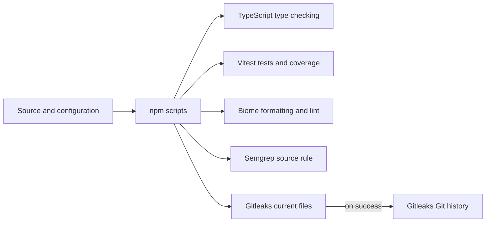

# ship-kit

A reusable TypeScript starter with strict type checking, tests and coverage,
formatting/linting, and local source-code and secret scans.

**Status — 2026-09-12:** local tooling verified; CI implementation in progress.
The local workflow includes quality checks, Semgrep, and both Gitleaks scans.
The first verified GitHub run is next, followed by build/deployment and template
publication. This project is not shipped.
See the [implementation plan](docs/implementation-plan.md) and
[next-session handoff](docs/handoff.md).

The roadmap target is:

> A TypeScript project template that goes from clone to live URL in ten minutes, with tests, CI and supply-chain checks already wired.

That deployment target is unmeasured and not yet implemented. The current
Semgrep and Gitleaks commands inspect source and secret patterns; they do not
provide dependency-vulnerability or provenance verification.

## What it does

The example module and its test exercise the tools that later projects can reuse.
TypeScript checks the code's types, Vitest checks assertions and coverage, and
Biome enforces the saved formatting and lint rules. Semgrep applies one local
security rule; Gitleaks scans both current files and locally available Git history.

## Architecture

Current local commands:



The local [CI workflow](.github/workflows/ci.yml) invokes formatting, lint,
typecheck, coverage, and Semgrep after checkout and installation. It targets
pushes and pull requests to `main`. It also installs Gitleaks and scans current files and full Git history. No
GitHub workflow run has been verified. No build or deployment step exists.

## Why this design

1. **Explicit runtime and dependency pins:** `.nvmrc`, engine requirements, and
   the npm lockfile keep the selected setup visible. A floating runtime is easier
   to upgrade but can make different machines run different tool versions.
2. **Small local commands:** Biome handles formatting and linting together;
   Vitest provides tests and coverage. Separate scripts make failures easier to
   identify than a single opaque command. Coverage does not measure assertion quality.
3. **Local scanners:** Semgrep's original rule is reviewable with the template,
   though its coverage is much narrower than a maintained rule collection.
   Standalone Gitleaks works with current files and Git history. Scanner binaries
   are separate prerequisites with manual pins; see their [setup and tradeoffs](docs/scanners.md).

Architecture decisions with lasting consequences belong in
[ADRs](docs/adr/001-record-architecture-decisions.md).

## Run it

On a new machine, follow [runtime setup](docs/runtime.md), then:

```bash
nvm install
nvm use
npm ci
```

Install the external scanner CLIs using [scanner setup](docs/scanners.md).
`npm ci` installs the JavaScript tools; it does not install Semgrep or Gitleaks.
Then run:

```bash
npm run format:check
npm run lint
npm run typecheck
npm test
npm run coverage
npm run scan:code
npm run scan:secrets
```

Use `npm run format` to apply the two-space formatting standard. Zed project
settings match this preference; automatic YAML formatting is disabled to preserve
standalone list dashes. Once a terminal is using the
pinned runtime, repeated `nvm use` is unnecessary; use it when selecting a
different project's runtime or correcting the active version.

## Numbers

Observed local evidence and its limits are recorded in the
[current checkpoint](docs/checkpoint-2026-09-12.md); the
[September 10 review](docs/checkpoint-2026-09-10.md) preserves earlier evidence.

| Metric | Observed value | Evidence |
| --- | --- | --- |
| Test suite | 1 test | Vitest |
| Statement and line coverage | 1/1 each | Coverage summary |
| Branch and function coverage | 0/0 each | Example has neither |
| Semgrep rule scope | 1 direct-eval rule over 2 TypeScript files | Local scan |
| Gitleaks history on 2026-09-12 | 3 local commits | History scan |
| Clone-to-live setup time | Unmeasured | Deployment pending |

## Where it fails

- The example is intentionally tiny; passing checks do not establish production readiness.
- Semgrep checks direct `eval` calls only. Gitleaks uses patterns and can miss
  secrets or report false positives; it does not prove whether a credential works.
- Git history scanning only covers history available locally. Git and scanner
  ignores have different behavior; see [scanner scope](docs/scanners.md).
- YAML and TOML configuration parsing is verified by their scanners. The current
  Biome format/lint checks cover supported files, not every file in the repository.
- CI is only partially implemented locally; GitHub execution is unverified.
  Build/deployment, a recorded demo, template publication, and a measured
  deployment quickstart remain pending.

## Out of scope

Application features, Docker, monorepo tooling, and publishing a scaffolder.

## Versions

Current project pins, checked against saved configuration and installed tools:

| Tool | Pin |
| --- | --- |
| Node / bundled npm | 24.20.0 / 11.19.0 |
| TypeScript | 7.0.2 |
| Vitest / V8 coverage provider | 5.0.0 / 5.0.0 |
| Vite | 8.2.2 |
| Biome | 2.5.12 |
| Node type declarations | 24.13.3 |
| Semgrep CLI | 1.176.1 |
| Gitleaks CLI | 8.30.1 |

These are selected pins, not claims that every tool is the latest release.
Runtime provenance is in [runtime setup](docs/runtime.md); scanner release
sources and installation are in [scanner setup](docs/scanners.md).
Dependency pins and resolved packages are recorded in `package.json` and
`package-lock.json`. Final tooling choices and measured deployment evidence
remain part of the [implementation plan](docs/implementation-plan.md).
